# Social Media Engagement Analysis (Python Data Analytics Project)

## Project Overview

This project performs a comprehensive analysis of a **Social Media Engagement Dataset** using Python.  
The goal is to explore patterns in engagement behavior across platforms, campaigns, brands, locations, and emotional sentiment.

The project demonstrates a full **data analytics workflow**, including:

- Data Cleaning
- Exploratory Data Analysis
- Statistical Analysis
- Behavioral Insights
- Professional Data Visualization

The analysis is conducted using **Pandas, NumPy, and Matplotlib**, focusing on extracting meaningful insights from social media engagement metrics.

---

# Technologies Used

- Python
- Pandas
- NumPy
- Matplotlib
- Jupyter Notebook

---

# Dataset Description

The dataset contains **12,000 social media posts** with **28 attributes** representing various aspects of content performance and user engagement.

### Key Columns

| Column | Description |
|------|------|
| platform | Social media platform |
| engagement_rate | Engagement per impression |
| likes_count | Number of likes |
| shares_count | Number of shares |
| comments_count | Number of comments |
| sentiment_score | Sentiment analysis score |
| emotion_type | Emotional tone of the post |
| campaign_name | Marketing campaign |
| brand_name | Brand associated with the post |
| product_name | Product referenced |
| location | Geographic location |
| toxicity_score | Toxicity level of content |

---

# Project Workflow

The project is divided into **five analytical phases**.

---

# Phase 1 — Data Integrity & Cleaning

This phase ensures the dataset is reliable and ready for analysis.

### Tasks Performed

- Data type optimization
- Missing value detection
- Duplicate post detection
- Sentiment label validation
- Engagement rate recalculation

### Key Observations

- The dataset contains **12,000 records and 28 variables**.
- The `mentions` column had **~32.8% missing values**, which were replaced with `"No Mention"`.
- No duplicate posts were found.
- Sentiment scores align correctly with sentiment labels.

---

# Phase 2 — Exploratory Data Analysis

This phase investigates **platform behavior, time trends, and content performance**.

### Questions Explored

- Which platform generates the highest engagement?
- Which day of the week performs best?
- Which content topics drive the most interaction?
- Which emotions trigger engagement?
- Which campaign phases perform best?

---

# Phase 3 — Statistical Analysis

Statistical techniques were applied to identify deeper patterns.

### Key Analysis

- Viral post detection using **95th percentile**
- Sentiment vs engagement correlation
- Caption length impact
- Buzz volatility across platforms

---

# Phase 4 — Behavioral Insights

This phase explores **user behavior and sentiment dynamics**.

### Analysis Performed

- Toxicity vs engagement correlation
- Sentiment shift compared to historical user sentiment

---

# Phase 5 — Visual Analytics

Professional visualizations were created using **Matplotlib** to illustrate insights.

---

# Data Visualizations

## 1 Platform Engagement Comparison
Shows which social media platforms generate the highest engagement.

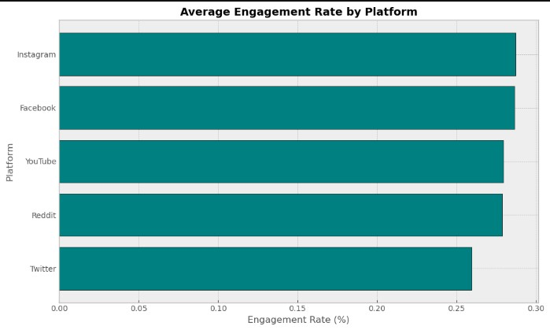

---

## 2 Sentiment vs Engagement Density
A hexbin visualization showing engagement concentration across sentiment scores.

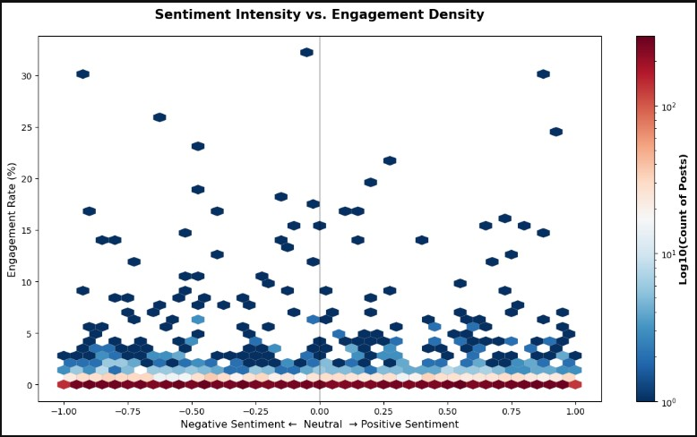

---

## 3 Weekly Engagement Trend
Displays how engagement varies across days of the week.

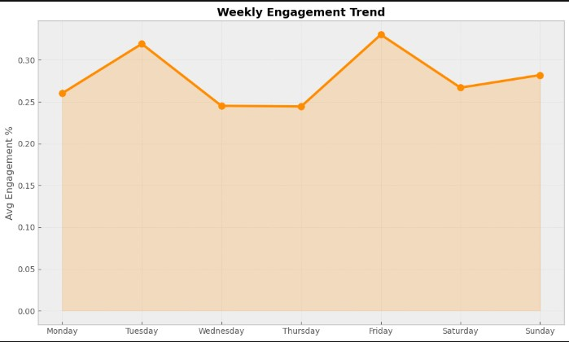

---

## 4 Emotion Distribution
Shows the proportion of posts expressing different emotions.

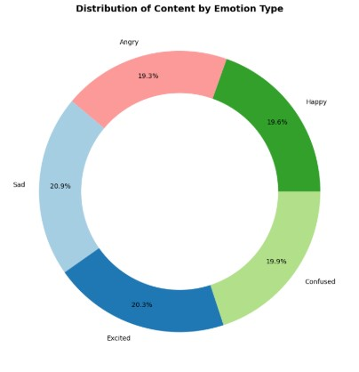

---

## 5 Campaign Phase Performance
Compares engagement across campaign stages.

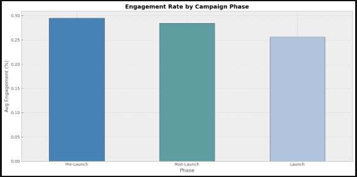

---

## 6 Engagement Distribution
Shows the long-tail distribution of engagement.

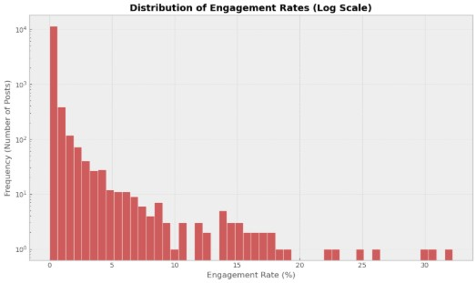

---
## 11 Hourly Engagement Rate Distribution
Visualizes how engagement varies across posts.

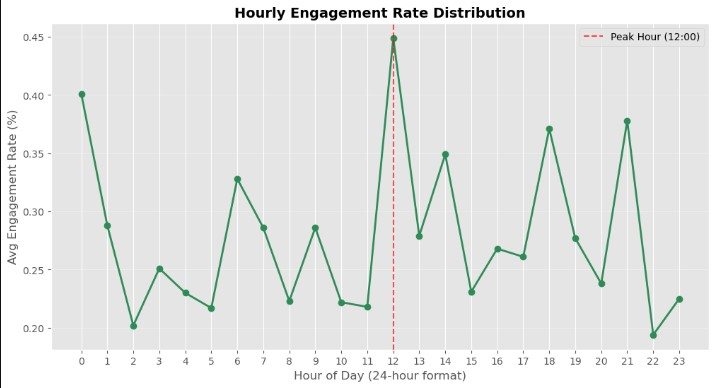

## 8 Brand Performance
Identifies which brands generate the highest engagement.

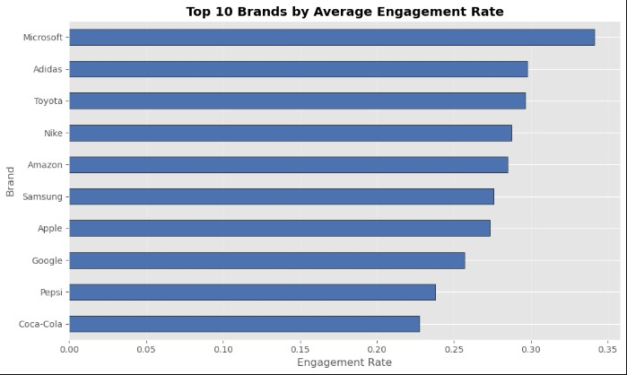

---

## 9 Product Performance
Shows top-performing products.

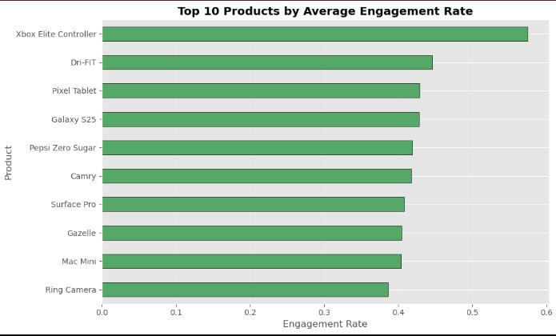

---

## 10 Campaign Performance
Highlights the most successful campaigns.

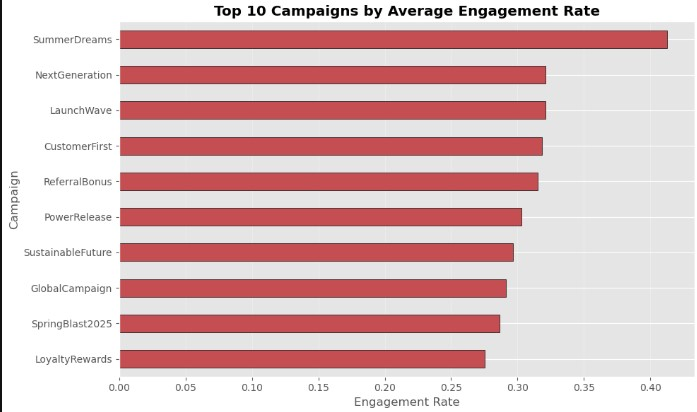

---

## 11 Location Engagement Heatmap
Shows engagement differences across geographic regions.

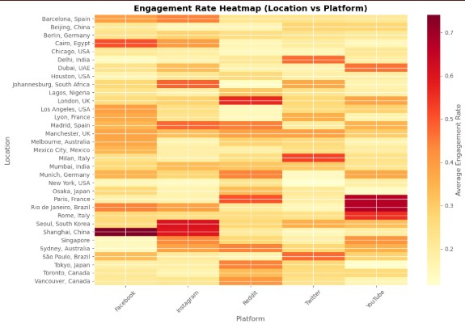

---

---

# Key Insights

### Platform Insights
- **Instagram and Facebook show the highest engagement rates.**
- Twitter shows comparatively lower engagement.

### Time Insights
- Engagement peaks on **Friday and Tuesday**.

### Content Insights
- Topics related to **Returns and Product issues** receive strong engagement.
- Emotional posts (especially **Excited and Sad**) drive interaction.

### Campaign Insights
- **Pre-Launch campaigns outperform Launch campaigns.**

### Viral Content
- The **top 5% of posts** are considered viral.

### Sentiment Insights
- Sentiment score shows **almost no correlation with engagement**.

### Toxicity
- Toxic content **does not significantly increase engagement**.

### Engagement Distribution
- Engagement follows a **long-tail distribution** where a few posts generate extremely high interaction.

---

# Challenges Faced

### Handling Missing Data
The `mentions` column contained significant missing values which needed proper handling.

### Engagement Metric Validation
The engagement rate needed to be recalculated to ensure consistency across the dataset.

### Data Type Optimization
Several columns required conversion to categorical types to improve memory efficiency.

### Visualization Balance
Choosing appropriate visualization types that clearly communicate insights without overwhelming the reader.

---

# What I Learned

Through this project, I developed practical experience in:

### Data Cleaning
Handling missing values, validating data quality, and optimizing data types.

### Exploratory Data Analysis
Identifying patterns across multiple categorical and numerical variables.

### Statistical Thinking
Using correlation analysis and percentile-based thresholds to extract insights.

### Data Visualization
Designing clear and informative visualizations using Matplotlib.

### Analytical Thinking
Transforming raw data into meaningful business insights.

---

# How to Run This Project

### 1 Install Required Libraries

### 2 Download the Dataset

Place the dataset file in the project directory.

### 3 Run the Notebook

Execute the notebook or Python script to reproduce the analysis.

---

# Project Purpose

This project demonstrates a **complete Python-based data analytics workflow** and showcases skills in:

- Data preprocessing
- Exploratory analysis
- Statistical reasoning
- Visualization
- Insight generation

It serves as a **portfolio project for data analytics and data science roles**.

---

# Author
Krutika Chaudhari
Python Data Analytics Project  
Social Media Engagement Analysis
